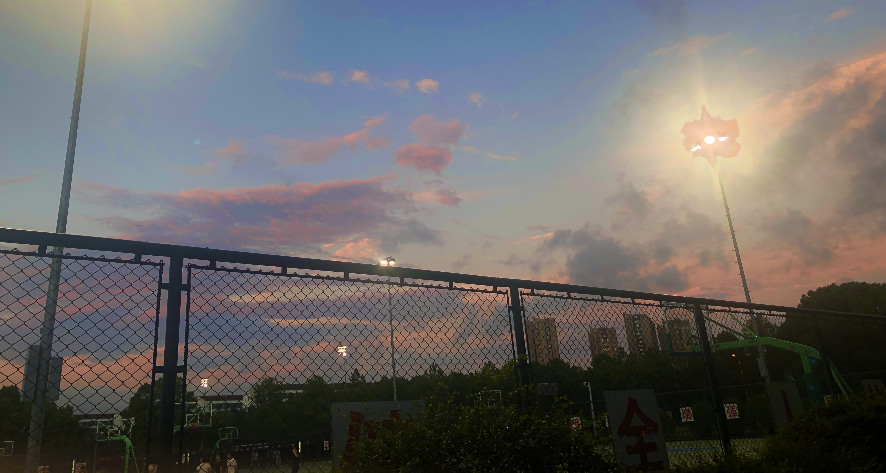

<!--
**doubleZ0108/doubleZ0108** is a ✨ _special_ ✨ repository because its `README.md` (this file) appears on your GitHub profile.

Here are some ideas to get you started:

- 🔭 I’m currently working on ...
- 🌱 I’m currently learning ...
- 👯 I’m looking to collaborate on ...
- 🤔 I’m looking for help with ...
- 💬 Ask me about ...
- 📫 How to reach me: ...
- 😄 Pronouns: ...
- ⚡ Fun fact: ...
-->
<h5 align="center">Some good moments</h5>

  <h3 align="center">沈韬｜Tao Shen(ShaoCHi)</h3>
  <h5 align="center">Just want to eat delicious food!!!!😄 😄 😄 😄 😄 </h5>
  <h5 align="left">🔭 I’m currently working on Tongji University</h5>
  <h5 align="left">⚡ Fun fact:LOL Music and Delicious Food🌱🌱🌱🌱🌱</h5>
  <h5 align="left">📫 How to reach me:1952395@tongji.edu.cn Let's have a nice lunch!</h5>

<!-- 
blur: 5px 0.22%
border-radius: 20px 
-->

  

<!-- 

 -->
